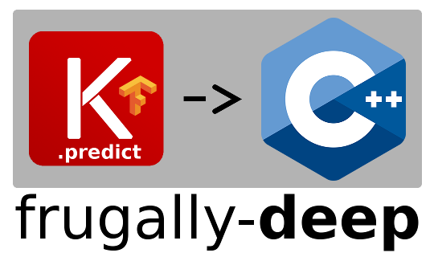

[](https://github.com/Dobiasd/frugally-deep/actions)
[][license]

[license]: LICENSE

frugally-deep
=============

**Use Keras models in C++ with ease**

Table of contents
-----------------

* [Introduction](#introduction)
* [Usage](#usage)
* [Requirements and Installation](#requirements-and-installation)
* [FAQ](#faq)

Introduction
------------

Would you like to build/train a model using Keras/Python? And would you like to run the prediction (forward pass) on your model in C++ without linking your application against TensorFlow? Then frugally-deep is exactly for you.

**frugally-deep**

* **is a small header-only library** written in modern and pure C++.
* is very easy to integrate and use.
* depends only on [FunctionalPlus](https://github.com/Dobiasd/FunctionalPlus), [Eigen](http://eigen.tuxfamily.org/) and [json](https://github.com/nlohmann/json) - also header-only libraries.
* supports inference (`model.predict`) not only for [sequential models](https://keras.io/getting-started/sequential-model-guide/) but also for computational graphs with a more complex topology, created with the [functional API](https://keras.io/getting-started/functional-api-guide/).
* re-implements a (small) subset of TensorFlow, i.e., the operations needed to support prediction.
* results in a much smaller binary size than linking against TensorFlow.
* works out-of-the-box also when compiled into a 32-bit executable. (Of course, 64 bit is fine too.)
* avoids temporarily allocating (potentially large chunks of) additional RAM during convolutions (by not materializing the im2col input matrix).
* utterly ignores even the most powerful GPU in your system and uses only one CPU core per prediction. ;-)
* but is quite fast on one CPU core, and you can run multiple predictions in parallel, thus utilizing as many CPUs as you like to improve the overall prediction throughput of your application/pipeline.


### Supported layer types

* `Add`, `Concatenate`, `Subtract`, `Multiply`, `Average`, `Maximum`, `Minimum`, `Dot`
* `AveragePooling1D/2D/3D`, `GlobalAveragePooling1D/2D/3D`
* `TimeDistributed`
* `Conv1D/2D`, `SeparableConv2D`, `DepthwiseConv2D`
* `Conv1DTranspose`, `Conv2DTranspose`
* `Cropping1D/2D/3D`, `ZeroPadding1D/2D/3D`, `CenterCrop`
* `BatchNormalization`, `Dense`, `Flatten`, `Normalization`
* `Dropout`, `AlphaDropout`, `GaussianDropout`, `GaussianNoise`
* `SpatialDropout1D`, `SpatialDropout2D`, `SpatialDropout3D`
* `ActivityRegularization`, `LayerNormalization`, `UnitNormalization`
* `RandomContrast`, `RandomFlip`, `RandomHeight`
* `RandomRotation`, `RandomTranslation`, `RandomWidth`, `RandomZoom`
* `MaxPooling1D/2D/3D`, `GlobalMaxPooling1D/2D/3D`
* `UpSampling1D/2D`, `Resizing`, `Rescaling`
* `Reshape`, `Permute`, `RepeatVector`
* `Embedding`, `CategoryEncoding`
* `Attention`, `AdditiveAttention`, `MultiHeadAttention`

### Also supported

* different activiations (`celu`, `elu`, `exponential`, `gelu`, `hard_shrink`, `hard_sigmoid`, `hard_tanh`, `leaky_relu`, `leakyrelu`, `linear`, `log_sigmoid`, `log_softmax`, `prelu`, `relu`, `relu6`, `selu`, `shared_activation`, `sigmoid`, `silu`, `soft_shrink`, `softmax`, `softplus`, `softsign`, `sparse_plus`, `squareplus`, `swish`, `tanh`, `tanh_shrink`, `threshold`)
* multiple inputs and outputs
* nested models
* residual connections
* shared layers
* variable input shapes
* arbitrary complex model architectures / computational graphs
* custom layers (by passing custom factory functions to `load_model`)

### Currently not supported are the following:

`Lambda` ([why](FAQ.md#why-are-lambda-layers-not-supported)),
`Conv3D`, `ConvLSTM1D`, `ConvLSTM2D`, `Discretization`,
`GRUCell`, `Hashing`,
`IntegerLookup`,
`LocallyConnected1D`, `LocallyConnected2D`,
`LSTMCell`, `Masking`,
`RepeatVector`, `RNN`, `SimpleRNN`,
`SimpleRNNCell`, `StackedRNNCells`, `StringLookup`, `TextVectorization`,
`Bidirectional`, `GRU`, `LSTM`, `CuDNNGRU`, `CuDNNLSTM`,
`ThresholdedReLU`, `Upsampling3D`, `temporal` models

Usage
-----

1) Use Keras/Python to build (`model.compile(...)`), train (`model.fit(...)`) and test (`model.evaluate(...)`) your model as usual. Then save it to a single file using `model.save('....keras')`. The `image_data_format` in your model must be `channels_last`, which is the default when using the TensorFlow backend. Models created with a different `image_data_format` and other backends are not supported.

2) Now convert it to the frugally-deep file format with `keras_export/convert_model.py`

3) Finally load it in C++ (`fdeep::load_model(...)`) and use `model.predict(...)` to invoke a forward pass with your data.

The following minimal example shows the full workflow:

```python
# create_model.py
import numpy as np
from keras.layers import Input, Dense
from keras.models import Model

inputs = Input(shape=(4,))
x = Dense(5, activation='relu')(inputs)
predictions = Dense(3, activation='softmax')(x)
model = Model(inputs=inputs, outputs=predictions)
model.compile(loss='categorical_crossentropy', optimizer='nadam')

model.fit(
    np.asarray([[1, 2, 3, 4], [2, 3, 4, 5]]),
    np.asarray([[1, 0, 0], [0, 0, 1]]), epochs=10)

model.save('keras_model.keras')
```

```bash
python3 keras_export/convert_model.py keras_model.keras fdeep_model.json
```

```cpp
// main.cpp
#include <fdeep/fdeep.hpp>
int main()
{
    const auto model = fdeep::load_model("fdeep_model.json");
    const auto result = model.predict(
        {fdeep::tensor(fdeep::tensor_shape(static_cast<std::size_t>(4)),
        std::vector<float>{1, 2, 3, 4})});
    std::cout << fdeep::show_tensors(result) << std::endl;
}
```

When using `convert_model.py` a test case (input and corresponding output values) is generated automatically and saved along with your model. `fdeep::load_model` runs this test to make sure the results of a forward pass in frugally-deep are the same as in Keras.

For more integration examples please have a look at the [FAQ](FAQ.md).

Requirements and Installation
-----------------------------

- A **C++14**-compatible compiler: Compilers from these versions on are fine: GCC 4.9, Clang 3.7 (libc++ 3.7) and Visual C++ 2015
- Python 3.9 or higher
- TensorFlow 2.18.0
- Keras 3.8.0

(These are the tested versions, but somewhat older ones might work too.)

Guides for different ways to install frugally-deep can be found in [`INSTALL.md`](INSTALL.md).

FAQ
---

See [`FAQ.md`](FAQ.md)

Disclaimer
----------

The API of this library still might change in the future. If you have any suggestions, find errors, or want to give general feedback/criticism, I'd [love to hear from you](issues). Of course, [contributions](pulls) are also very welcome.

License
-------

Distributed under the MIT License.
(See accompanying file [`LICENSE`](LICENSE) or at
[https://opensource.org/licenses/MIT](https://opensource.org/licenses/MIT))
