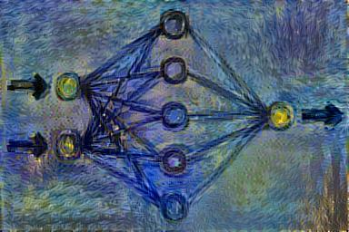

frugally-deep
=============

**is just a bunch of random code, intended solely for my personal learning pleasure.**

The goal is that someday the following things will be true:

**frugally-deep**

* **is a header-only deep learning framework written in C++.**
* is frugal because it is minimalistic and tries to consume not so much memory.
* supports the creation and training of convolutional neural networks.
* only has one dependency ([FunctionalPlus](https://github.com/Dobiasd/FunctionalPlus))
* can use multiple CPUs.
* is quite slow nonetheless.
* does not make use of GPUs.
* is a needlessly reinvented wheel.
* possibly has some unknown bugs.
* is poorly documented.
* should probably not be used for anything serious.
* is merely intended to be a personal learning project.

todo
----

ist es mit floats schneller als mit doubles?

elu layer ausgabe checken

cifar10 mal nur mit fc trainieren

regularization to prevent overfitting (penalize squared weight sum, dropout. not needed for autoencoder?) jedes weight sollte nah an seiner standard-abweichung vom init sein

reduce RAM usage have training-data in mem as uchars, not as doubles

jedem weight seine eigene learning rate geben?

learning rates should be proportional to the square root of the number of inputs to the unit. Gilt das noch bei Relu und co?

learning momentum in batch mode (SGD+Nesterov momentum or Adam)
http://cs231n.github.io/neural-networks-3/

allow different strides for conv and for pool

tests in separate cpp

mnist tests
https://compvisionlab.wordpress.com/2014/01/01/c-code-for-reading-mnist-data-set/

Increase minibatch size while training

Mini batches: Shuffle input, same amount of every class in batch if possible

Training per epoch

softmax-layer: Why does backprop for std::exp(x - in_vol_max_) not work so well?

flatten nestes multilayer nets? Ideally directly create them that way

typedefs.h nach config.h umbenennen und globals da rein

clean up training.h

spiral dataset as a test ( http://cs231n.github.io/neural-networks-case-study/ )

backprop: use bfgs etc. on param-derivs

use cmake with google tests (see fplus)
convolution: different paddings, different steps. With step 2 one could get rid of pooling layers
dilated convolutions? (http://cs231n.github.io/convolutional-networks/)

layers to implement:
transposed convolution layer aka deconv aka unconv aka fractional step conv
loss layers additionally to sigmoid cross entropy?: Multiclass Support Vector Machine loss (SVM) manhattan (l1)?, euclidian (l2)?

mini-batches (multiple images concatted in one pass)

split a validation set from the training set to optimize the hyperparameters

rule of thumb: 10 times more training examples than parameters

evolutionary optimization instread of backprop? (momentum mutations? recombination?)
particle swarm optimization? verteilen, gute habe gravitation, andere fliegen dahin, momentum, random speed changes annealing, best reproduces with mutation and worst dies

json rausschreiben zwischendurch (losses, weight distribution) (temp, rename), html viewer dazu
visualize layer and filters as images
start one async task per filter in layer? (fplus::execute_paralelly?)

Affine layer- flow layer?
or instead of affine: http://torch.ch/blog/2015/09/07/spatial_transformers.html
Local Response Normalization layer?

Skip connection aka computational graph?
paralell_layer (nimmt split_layer-Ableitung und merge_layer-Ableitung (avg oder concat_z) und zwei listen aus layern, die auch leer sein können). Die werden dann nebeneinander ausgeführt (nicht zeitlich). skip_layer ist dann meta-Funktion, die einem was baut.

Caffee import?

### ideas/goals

image autoencoder

image classification

neural style perceptual loss
https://arxiv.org/abs/1603.08155

semantic morphing (e.g. faces)

video autoencoder? (Spatio-temporal? would mean matrix4d)

Video compression
zweites video dabei, was die differenzframes drin hat
anfang vom neuronalen netz koennte der codec sein und nur der FC-Layer waere das eigentliche Video
oder low-bitrate-video so nachverbessern? https://arxiv.org/pdf/1504.06993.pdf